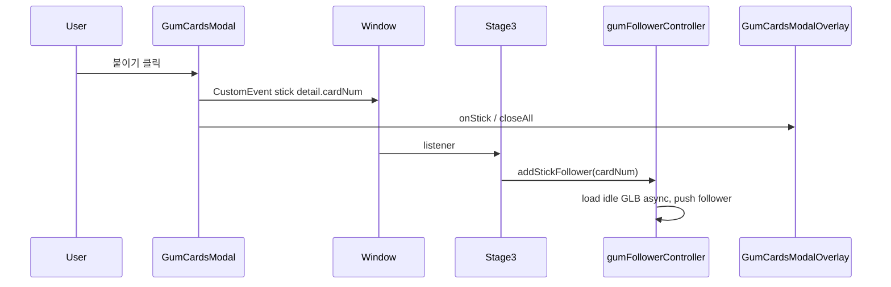

# Stage3 껌 카드 「붙이기」: 3D 팔로워 + 타로 껌딱지(머리 위 비행)

이 문서는 다음 두 설계안을 하나로 정리한 것이다.

- 껌카드 붙이기 3D 팔로워 (모달 → 이벤트 → 동적 팔로워 추가)

- 타로 껌딱지 동반 (유저 머리 위·카메라 정면 포즈·**idle GLB만**·씬에서 비행)

관련 코드는 주로 `src/utils/stages/stage3/gumFollowerController.js`, `src/config/gumCardStickFollowers.js`, `src/events/gumCardsEvents.js`, `src/components/GumCardsModal*.jsx`, `src/stages/Stage3.js`에 있다.

---

## 1. 껌 카드 「붙이기」→ 3D 껌딱지 추가 (Stage3)

### 1.1 맥락

- 텐트 클릭 → `openGumCardsModal` (`src/utils/stages/stage3/gumCardsModalLauncher.js`) → React `GumCardsModalOverlay`가 `GumCardsModal`을 연다.

- 3D 껌딱지 2마리는 Stage3 전용 `createGumFollowersController`에서 `STAGE3_CHARACTER_CONFIG.character.gumFollowers`의 `gum_walk_final.glb` + 기본 idle `gum_idle.glb`로 초기화된다.

- 기존에는 `GumCardsModal`의 붙이기 동작이 파티클·토스트만 하고 모달을 닫지 않으며 씬과 통신하지 않았다.

구현 범위는 **Stage3 + React 모달 + 껌 팔로워 컨트롤러**이며, Stage2 빔 씬과는 별개다.

### 1.2 목표 동작

1. 카드를 뒤집은 뒤 **「이 껌딱지 나한테 붙이기」** 클릭 시: 모달(및 텐트 오버레이)이 닫히고, 선택한 카드 식별자(`card.num`)가 씬으로 전달된다.

2. 예시 **카드 `01`(타로 껌딱지)** 에 대해:

   - **타로 껌 메시만 로드한다.** `public/models/common/gum/taro_gum/taro_gum.glb` 를 쓴다. **지면 걸음·달리기 연출은 쓰지 않고**, 움직임은 Three.js 루트 변환으로만 준다(필요 시 GLB 내 짧은 idle 클립만 재생 가능).

   - 캐릭터의 움직임은 전부 **Three.js에서 루트 오브젝트 변환**(위치·회전·가벼운 사인/원 궤도 등)으로만 표현해, **머리 위를 날아다니는 느낌**을 낸다.

3. **A/B보다 뒤·느리게** 같은 지면 슬롯 추종이 아니라, **§2**의 동반 규칙(머리 위 오프셋·카메라 정면 등)을 따른다. 다른 카드가 나중에 지면 팔로워 패턴을 쓰면 그때 `distance` / `followLerpFactor` / `side` 등을 맵에서 분기하면 된다.

### 1.3 React ↔ Three 통신

이벤트 이름은 `src/events/` 아래 상수로 고정한다.

- `src/events/gumCardsEvents.js` — 예: `GUM_CARDS_STICK_EVENT`, `detail: { cardNum: string }`.

- `GumCardsModal`: `onStick(card)` 콜백 prop. `handleStick`에서 `onStick(flippedCard)` 호출.

- `GumCardsModalOverlay`: `onStick`에서 `window.dispatchEvent(new CustomEvent(..., { detail }))` 후 `closeAll()`로 텐트 단계까지 닫기.

### 1.4 카드별 다른 캐릭터 (확장)

**단일 소스**: 카드 번호 → 3D 에셋·행동 오버라이드 매핑.

- 설정 모듈: `src/config/gumCardStickFollowers.js` — `GUM_CARD_STICK_FOLLOWER_BY_NUM`.

  - 키: `card.num` (`"01"` … `"08"`).

  - 값: `{ modelPath?, idleModelPath, scale?, behavior?: { … } }`. 타로 껌처럼 **idle만 쓰는 슬롯**은 `modelPath`(walk)를 생략하거나 동일 키로 idle만 두고, 컨트롤러에서 **walk 클립·믹서 분기를 타지 않게** 한다.

- `src/config/gumCardsConfig.js`의 UI용 `CARDS`는 그대로 두고, **3D만** 위 맵에서 조회한다.

- 맵에 없는 번호는 무시하거나 토스트만 — 초기에는 `01`만 처리해도 된다.

### 1.5 `gumFollowerController.js` 변경 요약

`init()`에서 한 쌍의 GLB만 로드해 A/B를 만든다. 동적 카드 껌은 카드마다 다른 경로·행동이므로 `followers[]` 항목에 **슬롯별 오버라이드**를 두고, 공통 `update` 루프에서 항목 타입(지면 추종 vs 머리 위 비행)에 따라 분기한다.

- **`addStickFollower(cardNum)`** (async): 맵 조회 → **해당 카드가 idle-only면 idle GLB만** 로드 → 믹서 없이 단일 메시/스킨만 씬에 붙여도 된다.

- **`cleanup()`**: scene 제거 + mixer stop(있을 때만) + 동적 항목 포함 전부 정리.

- **초기화 순서**: `gumFollowers.init()` 완료 전 요청이 올 수 있으므로, `isReady`가 false면 **큐에 넣었다가 init 완료 시 처리**한다.

- **중복 붙이기**: 세션당 카드당 1마리 등 정책을 한 줄로 정한다.

### 1.6 타입·문서

- `src/types.js`: 스틱 팔로워 설정에 `idleModelPath`만 필수인 케이스를 JSDoc으로 구분할 수 있다.

- 선택: 스틱 맵용 `@typedef`를 설정 파일 상단에 둔다.

### 1.7 검증·주의

- 브라우저: `/dev`에서 Stage3, 텐트 → 카드 → `01` 선택 → 붙이기 → 모달 종료 + 타로 껌이 **유저 머리 위**에서 idle 자세로 비행.

- `npm run lint`.

- `GumCardsModalOverlay.jsx`의 로컬호스트 디버그 `fetch` 블록은 기능과 무관하면 건드리지 않는 편이 diff를 깔끔하게 유지한다.

---

## 2. 타로 카드 껌딱지: 유저 머리 위 비행 (idle 전용)

### 2.1 하지 않는 것 (이전안 폐기)

- 멀리 떨어진 XZ에 스폰한 뒤 **걷기 메시·걷기 애니**로 슬롯 `_target`까지 접근하는 **걸어오기 인트로**는 쓰지 않는다.

- 타로 껌딱지용으로 **walk GLB**와 walk/idle 믹서 전환, `walkInIntroActive` 류의 지면 접근 루프는 설계 대상에서 제외한다.

### 2.2 목표 UX

1. 모달에서 붙인 직후, 해당 껌딱지는 **유저 캐릭터 머리 위** 근처에 나타난다. 수평 위치는 슬롯 정중앙 뒤가 아니라, **머리 기준으로 약간 사선**(예: 머리 정점에서 카메라 쪽·좌우 한쪽으로 소폭 비껴 배치)이어도 좋다. 정확한 오프셋은 아트/카메라 FOV에 맞춰 튜닝한다.

2. **자세**: 메시가 **카메라를 향하고**(billboard 또는 yaw만 카메라 맞춤), 동시에 **카메라 기준 좌측**을 바라보는 느낌이 나도록 고개·yaw 보정을 준다(모델 프리팹이 정면이 아니면 부모 그룹에 추가 회전).

3. **비행**: 매 프레임 유저 본 또는 캡슐 상단 등 **앵커 월드 좌표**에 로컬 오프셋을 더한 뒤, 작은 **상하·좌우 흔들림 또는 타원 궤도**를 더해 “머리 위를 맴돈다”는 인상을 준다. 이 변위는 전부 **오브젝트 transform**이며, **애니 클립 재생은 idle 루프만**(있을 경우) 또는 정적 포즈만으로 충분하다.

### 2.3 구현 요약 (`gumFollowerController.js`)

1. **팔로워 구분**: 스틱 항목에 `mode: 'headFloat'` 같은 플래그 또는 `behavior.attachMode`로 지면 팔로워와 분리한다.

2. **로드**: `idleModelPath`만 로드. AnimationMixer가 필요 없으면 생략한다.

3. **`update`**

   - 유저 루트/머리 본 월드 행렬에서 기준점을 구한다.

   - 카메라 `position`과 `getWorldDirection`으로 카메라 정면 벡터를 구하고, 껌 루트의 quaternion을 **카메라 바라보기 + 좌측 시선 보정**에 맞춘다.

   - 시간 `t`에 따른 소幅 오프셋을 더해 최종 `position`을 설정한다. AABB 슬라이드·`sampleGroundY`·지면 `_target` 접근은 이 모드에서는 사용하지 않는다.

4. **설정** — `src/config/gumCardStickFollowers.js`의 동작 스펙 예시(이름은 구현에 맞게 통일):

   - `headAnchor` — `"skull"` 등 본 이름 또는 `"capsuleTop"`

   - `headLocalOffset` — 머리 기준 사선 오프셋 `[x,y,z]`

   - `floatAmplitudeM` / `floatFrequencyHz` — 날아다니는 느낌 강도

   - `cameraFaceYawOffsetDeg` — “카메라 좌측을 본다”는 체감용 추가 yaw

### 2.4 모달·로드 순서 (검증용)

1. **「붙이기」 클릭** 후 이벤트로 `cardNum`이 Stage3에 전달되고 모달이 닫힌다.

2. **idle GLB**가 비동기로 끝나는 즉시 씬에 붙이고, 다음 `update`부터 머리 앵커·카메라 정면·비행 오프셋을 적용한다.

3. **개발 로그** (예): `[GumCardsStick] dispatch` → `[GumFollowers] stick head-float appended` 등.

### 2.5 검증

- 카드 붙이기 후: 타로 껌이 **walk 없이** idle 메시만으로 머리 위를 맴돈다.

- 카메라를 돌려도 대략 정면·좌측 시선 느낌이 유지되는지 확인한다.

- `npm run lint`.

---

## 3. 두 기능의 관계

| 구간 | 역할 |

|------|------|

| §1 | 모달·이벤트·맵·동적 GLB 로드·카드별 분기(지면 팔로워 vs idle-only 등) |

| §2 | 타로 껌: **idle 전용** + 유저 머리 위 앵커 + 카메라 정면 포즈 + transform 비행 |

실제 구현에서는 **§1으로 추가된 팔로워** 중 타로 카드에 해당하는 항목만 **§2의 머리 위 비행** 모드로 갱신하고, “멀리서 걸어와 합류” UX는 사용하지 않는다.

