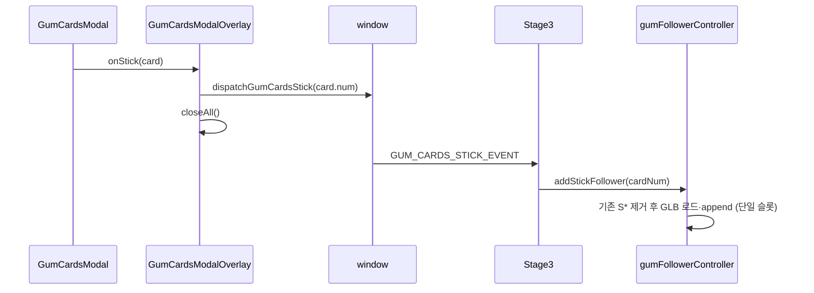

# Stage3 타로카드 껌딱지 「붙이기」구현 명세

텐트에서 타로 카드 모달을 연 뒤, 카드를 뒤집고 **「이 껌딱지 나한테 붙이기」**를 누르면 Stage3 씬에 **스틱 껌딱지 1마리**가 생긴다. 지면 A/B 껌딱지와 별개이며, **머리 위(headFloat)** 만 다룬다.

---

## 1. 사용자·데이터 흐름

1. `GumCardsModal`에서 붙이기 → `GumCardsModalOverlay`의 `onStick`이 `dispatchGumCardsStick(card.num)` 호출 후 `closeAll()` (텐트까지 닫힘).
2. `window`에 `GUM_CARDS_STICK_EVENT` (`gum:cardsStick`)가 올라가고, `detail.cardNum`은 `gumCardsConfig`의 `card.num`과 동일한 문자열 (`"01"`, `"02"` …).
3. `Stage3`가 이벤트를 받아 `gumFollowers.addStickFollower(cardNum)` 호출.
4. `gumFollowers.init()`이 아직 끝나지 않았으면 `cardNum`을 `stickQueue`에 넣고, `init` 완료 시 큐를 순서대로 비운다.

---

## 2. 이벤트·상수

| 항목 | 값 |
|------|-----|
| 파일 | `src/events/gumCardsEvents.js` |
| 이벤트명 상수 | `GUM_CARDS_STICK_EVENT` → `"gum:cardsStick"` |
| `detail` | `{ cardNum: string }` |
| 디스패치 함수 | `dispatchGumCardsStick(cardNum)` |

---

## 3. 카드 번호 → 3D 스펙 (단일 소스)

| 항목 | 설명 |
|------|------|
| 파일 | `src/config/gumCardStickFollowers.js` |
| 맵 이름 | `GUM_CARD_STICK_FOLLOWER_BY_NUM` |
| 키 | `card.num`과 동일한 문자열 (예: `"01"`, `"02"`) |
| 맵에 없는 `cardNum` | `addStickFollower`에서 무시(경고 로그만) |

### 3.1 스펙 객체 (`GumCardStickFollowerSpec`)

타로 스틱은 **`behavior.attachMode === "headFloat"`** 만 사용한다.

| 필드 | headFloat에서의 의미 |
|------|------------------------|
| `idleModelPath` | **필수에 가깝게 사용.** 로더는 `spec.idleModelPath ?? spec.modelPath`로 경로를 고른다. (이름은 `idle`이지만 walk 포함 GLB를 가리켜도 됨.) |
| `scale` | 루트 `Object3D`에 `setScalar` 적용. 생략 시 Stage3 `gumFollowers.models.scale`. |
| `behavior` | 아래 표 참고. |

### 3.2 `behavior` (headFloat)

| 필드 | 타입 | 기본(코드) | 설명 |
|------|------|------------|------|
| `attachMode` | `"headFloat"` | — | 지면 추종이 아님을 표시. |
| `headLocalOffset` | `[x,y,z]` | `[0, 0.4, 0]` | **유저 yaw**로만 회전시킨 뒤 머리 앵커에 더하는 오프셋(m). Y가 위로. |
| `floatAmplitudeM` | number | `0.06` | 떠다님 진폭(m). |
| `floatFrequencyHz` | number | `0.5` | `elapsedSec * 2π * freq`에 넣는 떠다님 주파수. |
| `cameraFaceYawOffsetDeg` | number | `0` | 목표 yaw = `userYaw + rad(이 값)`. 유저와 같은 방향 + GLB 전방 보정. |
| `tiltForwardDeg` | number | `0` | `rotation.x` 목표(도). |
| `headingYawEase` | number | `2.75` | yaw 보간: `turn = 1 - exp(-ease * delta)`, `lerpAngle(current, target, turn)`. 클수록 빠름. |
| `headFallbackYOffsetM` | number | `1.6` | `getHeadAnchorWorld` 실패 시 `userPos.y +` 이 값으로 대체 앵커. |
| `animationSpeed` | number | 스케일 기반 | GLB에 클립이 있으면 idle 믹서 `timeScale`. |
| `headAnchor` | string | (미사용) | JSDoc용; 실제 앵커는 캐릭터 `getHeadAnchorWorld`. |

### 3.3 에셋 경로 (현재 예시)

- 공통 디렉터리: `public/models/common/gum/taro_gum/`
- `01`: `gum_magnifier.glb`
- `02`: `gum_flashlight.glb`

Vite에서는 URL이 `/models/common/gum/taro_gum/...` 형태.

---

## 4. `createGumFollowersController` (핵심)

파일: `src/utils/stages/stage3/gumFollowerController.js`

### 4.1 생성 인자 (스틱 관련)

| 인자 | 용도 |
|------|------|
| `getUserState` | `{ position, yaw, moving }` — headFloat 위치·회전에 사용. |
| `getHeadAnchorWorld(out: Vector3): boolean` | 머리 월드 좌표. 실패 시 `headFallbackYOffsetM` 사용. |
| `getCamera` | (headFloat yaw에는 현재 미사용, 다른 팔로워용으로 전달 가능) |

### 4.2 스틱 팔로워 식별

- `followers[]` 항목의 `id`는 **`S` + `cardNum`** (정규식 `^S\d+$`). 예: `S01`, `S02`.
- 기본 A/B 팔로워는 `id`가 `A`, `B` — 스틱만 `S*`로 걸러서 제거·갱신한다.

### 4.3 단일 슬롯·교체·로드 경합

1. **`addStickFollower(cardNum)`**  
   - 맵에 없으면 return.  
   - `attachedStickCards.has(cardNum) || loadingStickCards.has(cardNum)` 이면 return (같은 카드 중복 붙이기·중복 로드 방지).  
   - `!isReady`이면 `stickQueue.push(cardNum)` 후 return.

2. **`loadAndAddStickFollower(cardNum)`** (async)  
   - 위 중복 검사를 통과한 뒤:  
   - `stickLoadToken += 1`, `const token = stickLoadToken`.  
   - **`removeAllStickCardFollowers()`**: `id`가 `^S\d+$`인 항목만 씬 제거·믹서 정지·`followers`에서 splice, `attachedStickCards.clear()`, `loadingStickCards`에서 맵에 정의된 카드 키 제거.  
   - `loadingStickCards.add(cardNum)` 후 GLB 로드.

3. **`stickLoadToken`**  
   - `await` 이후마다 `if (token !== stickLoadToken) return` 으로 append 생략.  
   - 사용자가 빠르게 `01`→`02`를 누르면 **늦게 끝난 이전 로드가 씬에 다시 붙지 않게** 한다.

4. **`cleanup()`**  
   - 전 팔로워 제거 후 `stickLoadToken = 0` 포함 스틱 관련 Set/큐 초기화.

### 4.4 headFloat 로드 (`attachMode === "headFloat"`)

1. 경로: `resolvePublicAssetUrl(idleModelPath ?? modelPath)`.
2. `loadGltfTemplateCached` → `!isReady` 또는 `token` 불일치 시 return.
3. 애니: 이름 정규식 `idle|stand|wait|pose|breath|rest` 우선, 없으면 첫 클립.
4. `appendHeadFloatStickFollower`: `SkeletonUtils.clone`, 그림자, `AnimationMixer`, `followers.push`, `scene.add(model)`, `attachMode: "headFloat"`, `headFloat` 설정 객체 저장.
5. 성공 시 `attachedStickCards.add(cardNum)`.  
6. `finally`에서 `loadingStickCards.delete(cardNum)`.

### 4.5 `update` 안 headFloat (`updateHeadFloatFollower`)

매 프레임 `userPos` / `userYaw` 필요 (`getUserState`가 null이면 전체 `update` 조기 return — 스틱도 갱신 안 됨).

**위치**

1. `haveHead = getHeadAnchorWorld(_stickHeadAnchor)`  
2. 실패 시: `_stickHeadAnchor.copy(userPos)`, `y += headFallbackYOffsetM`.  
3. `_stickHeadOffsetLocal.copy(headFloat.headLocalOffset)` 후 `makeRotationY(userYaw)`로 회전만 적용해 `_stickHeadAnchor`에 가산.  
4. `t = elapsedSec * 2π * floatFrequencyHz + floatPhase`  
   `bob = ( cos(t*0.9)*amp*0.85, sin(t*1.1)*amp, sin(t*0.75)*amp*0.65 )`  
5. `model.position = anchor + bob`.

**회전**

1. `mixer.update(delta)` 먼저.  
2. `targetYaw = userYaw + degToRad(cameraFaceYawOffsetDeg)`  
   `turnYaw = 1 - exp(-headingYawEase * delta)`  
   `rotation.y = lerpAngle(rotation.y, targetYaw, turnYaw)`.  
3. `rotation.x` / `z`는 `tiltForwardDeg` 및 0으로 선형 보간(`turnTilt = min(1, 10*delta)`).

**다른 팔로워와의 분리**

- walk/idle 토글 루프에서 `attachMode === "headFloat"` 는 **스킵**.  
- 지면 `_target` / `sampleGroundY` / 충돌 슬라이드 분기에서 `attachMode === "headFloat"` 이면 **위 블록만 실행 후 return**.

---

## 5. Stage3 연결

파일: `src/stages/Stage3.js`

- `window.addEventListener(GUM_CARDS_STICK_EVENT, handleGumCardsStickEvent)` — `detail.cardNum` 문자열 검증 후 `gumFollowers?.addStickFollower(cardNum)` 또는 `pendingGumStickCardNums`에 push.
- `createGumFollowersController({ … getHeadAnchorWorld: (out) => character?.getHeadAnchorWorld?.(out) ?? false })`.
- `gumFollowers.init()` 완료 `then`에서 `pendingGumStickCardNums` 비우며 `addStickFollower` 호출.
- 매 프레임 `gumFollowers.update(delta)`.
- 스테이지 `cleanup`에서 리스너 제거·`gumFollowers.cleanup()`.

---

## 6. 머리 앵커 (캐릭터)

파일: `src/utils/stages/stage3/characterController.js`

- `getHeadAnchorWorld(out)`  
  - 보이는 루트(걷기 중이면 walk 모델, 아니면 idle)에서 Bone 이름에 `"head"` 포함 시 그 본 `getWorldPosition`.  
  - 없으면 `Box3.setFromObject` 후 **XZ는 중심, Y는 `max.y`**.

---

## 7. 구현 체크리스트

- [ ] `GUM_CARD_STICK_FOLLOWER_BY_NUM`에 새 `card.num` 추가 시 `idleModelPath`·`attachMode: "headFloat"`·오프셋 튜닝.
- [ ] 붙이기 후 씬에 **`S*` 팔로워가 최대 1개**인지 (`01` 후 `02` 시 교체).
- [ ] 빠른 연속 클릭 시 **이전 GLB가 뒤늦게 붙지 않는지** (`stickLoadToken`).
- [ ] `/dev` Stage3, 텐트 → 카드 붙이기, 머리 위 비행·유저 yaw 동기.
- [ ] `npm run lint`

---

## 8. 범위 밖 (이 문서에서 다루지 않음)

- 지면 껌딱지 A/B 초기화·추종(`attachMode: "groundFollow"` + `modelPath` 등)은 동일 파일에 있으나 **타로 스틱 구현과 독립**이다.
- 타로 카드 UI 카피·이미지는 `gumCardsConfig.js` 등 UI 설정을 따른다.
